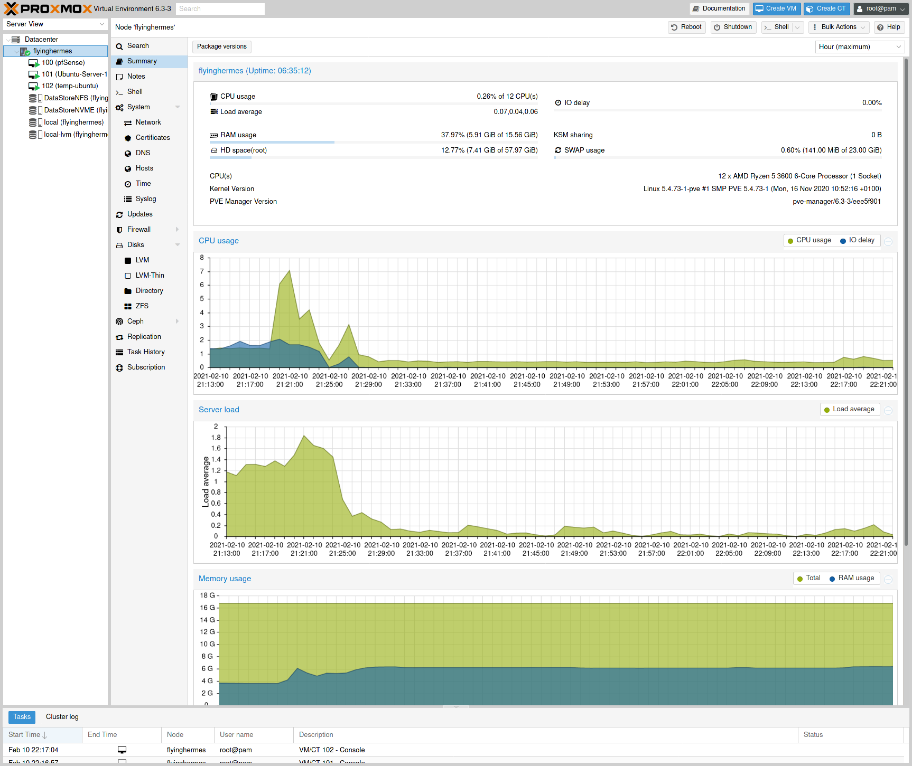

[![Contributors][contributors-shield]][contributors-url]
[![Forks][forks-shield]][forks-url]
[![Stargazers][stars-shield]][stars-url]
[![Issues][issues-shield]][issues-url]
[![GPL3 License][license-shield]][license-url]
[![LinkedIn][linkedin-shield]][linkedin-url]
[![Ask Me Anything][ask-me-anything]][personal-page]

<!-- PROJECT LOGO -->
 

  

  <h3 align="center">Home Lab</h3>

  

    This is a collection of code, readme and notes of my homelab setup. You wont find anything sensitive in here ;)  
    All IPs, IDs, Hostnames, Cluster names etc have been changed and all images have been taken form an example.  
    Using this code is for educational reasons and/or to help you start
     
    <a href="./README.md"><strong>Explore the docs »</strong></a>
     
     
<!--    <a href="https://github.com/stiliajohny/Repo-Template">View Demo</a>
    · -->
    <a href="https://github.com/stiliajohny/Repo-Template/issues/new?labels=i%3A+bug&template=1-bug-report.md">Report Bug</a>
    ·
    <a href="https://github.com/stiliajohny/Repo-Template/issues/new?labels=i%3A+enhancement&template=2-feature-request.md">Request Feature</a>
  

<!-- TABLE OF CONTENTS -->

## Table of Contents

- [Table of Contents](#table-of-contents)
- [About The Project](#about-the-project)
  - [Built With](#built-with)
- [Getting Started](#getting-started)
  - [Prerequisites](#prerequisites)
  - [Installation](#installation)
- [Usage](#usage)
- [Roadmap](#roadmap)
- [Contributing](#contributing)
- [License](#license)
- [Contact](#contact)
- [Acknowledgements](#acknowledgements)

<!-- ABOUT THE PROJECT -->

## About The Project

<!--
There are many great README templates available on GitHub, however, I didn't find one that really suit my needs so I created this enhanced one. I want to create a README template so amazing that it'll be the last one you ever need.

Here's why:

- Your time should be focused on creating something amazing. A project that solves a problem and helps others
- You shouldn't be doing the same tasks over and over like creating a README from scratch
- You should element DRY principles to the rest of your life :smile:

Of course, no one template will serve all projects since your needs may be different. So I'll be adding more in the near future. You may also suggest changes by forking this repo and creating a pull request or opening an issue.

A list of commonly used resources that I find helpful are listed in the acknowledgements.
-->

### Built With

- Proxmox
- Ansible
- Packer
- CloudInit
- Terraform
- Terraform Proxmox Provider
- Golang

---

## Getting Started

Get a local copy of the repo.
Ensure the Prerequisites are installed before starting.

### Prerequisites

- Proxmox [Installation steps](https://www.proxmox.com/en/proxmox-ve/get-started)
- Ansible [Installation steps](https://docs.ansible.com/ansible/latest/installation_guide/intro_installation.html)
- Packer [Installation steps](https://learn.hashicorp.com/tutorials/packer/getting-started-install)
- CloudInit [Installation steps](https://docs.rightscale.com/rl10/reference/10.6.0/rl10_cloud_init_installation.html)
- Terraform [Installation steps](https://www.terraform.io/downloads.html)
- Terraform Proxmox Provider [Installation steps](https://github.com/Telmate/terraform-provider-proxmox)
- Golang [Installation steps](https://golang.org/doc/install)

### Installation

At the time of this repo creation the following versions are the latests and working fine

- Proxmox 6.3
- Ansible 2.9.0
- Packer >1.6.6
- CloudInit 20.4.1
- Terraform 0.14.0
- Terraform Proxmox provider 2.6.7
- Golang 1.15.8

## Usage

1. Install Proxmox
   - Ensure the IP you will be using is available and accessible,
   - Use a strong password for your root user ( length>16 including numbers, uppercase and symbols )
1. Copy your ssh public key on the proxmox server for easier and more secure  ssh access
  - `$ ssh-copy-id root@192.168.1.22`
2. Run Ansible against the IP you used for the proxmox server
  - `$ ansible all -i 192.168.1.22, -m include_role -a name=proxmox -u root` 
    For more info on what this installs look into the ansible folder  [here](/ansible)
    
---

<!-- ROADMAP -->

## Roadmap

See the [open issues](https://github.com/stiliajohny/Repo-Template/issues) for a list of proposed features (and known issues).

---

<!-- CONTRIBUTING -->

## Contributing

Contributions are what make the open source community such an amazing place to be learn, inspire, and create. Any contributions you make are **greatly appreciated**.

1. Fork the Project
2. Create your Feature Branch (`git checkout -b feature/AmazingFeature`)
3. Commit your Changes (`git commit -m 'Add some AmazingFeature'`)
4. Push to the Branch (`git push origin feature/AmazingFeature`)
5. Open a Pull Request

---

<!-- LICENSE -->

## License

Distributed under the GPL-3.0 License. See `LICENSE` for more information.

<!-- CONTACT -->

## Contact

John Stilia - [@john_stilia](https://twitter.com/john_stilia) - [stilia.johny@gmail.com](mailto:stilia.johny@gmail.com)

<!--
Project Link: [https://github.com/your_username/repo_name](https://github.com/your_username/repo_name)
-->

---

<!-- ACKNOWLEDGEMENTS -->

## Acknowledgements

- [kevinalmansa](https://github.com/kevinalmansa/)  :metal:
- [GitHub Emoji Cheat Sheet](https://www.webpagefx.com/tools/emoji-cheat-sheet)
- [Img Shields](https://shields.io)
- [Choose an Open Source License](https://choosealicense.com)
- [GitHub Pages](https://pages.github.com)

<!-- MARKDOWN LINKS & IMAGES -->
<!-- https://www.markdownguide.org/basic-syntax/#reference-style-links -->

[contributors-shield]: https://img.shields.io/github/contributors/stiliajohny/Repo-Template.svg?style=for-the-badge
[contributors-url]: https://github.com/stiliajohny/Repo-Template/graphs/contributors
[forks-shield]: https://img.shields.io/github/forks/stiliajohny/Repo-Template.svg?style=for-the-badge
[forks-url]: https://github.com/stiliajohny/Repo-Template/network/members
[stars-shield]: https://img.shields.io/github/stars/stiliajohny/Repo-Template.svg?style=for-the-badge
[stars-url]: https://github.com/stiliajohny/Repo-Template/stargazers
[issues-shield]: https://img.shields.io/github/issues/stiliajohny/Repo-Template.svg?style=for-the-badge
[issues-url]: https://github.com/stiliajohny/Repo-Template/issues
[license-shield]: https://img.shields.io/github/license/stiliajohny/Repo-Template?style=for-the-badge
[license-url]: https://github.com/stiliajohny/Repo-Template/blob/master/LICENSE.txt
[linkedin-shield]: https://img.shields.io/badge/-LinkedIn-black.svg?style=for-the-badge&logo=linkedin&colorB=555
[linkedin-url]: https://linkedin.com/in/johnstilia/
[product-screenshot]: .assets/screenshot.png
[ask-me-anything]: https://img.shields.io/badge/Ask%20me-anything-1abc9c.svg?style=for-the-badge
[personal-page]: https://github.com/stiliajohny

https://img.shields.io/github/license/othneildrew/Best-README-Template.svg?style=for-the-badge
https://img.shields.io/github/license/stiliajohny/Repo-Template.svg?style=for-the-badge
